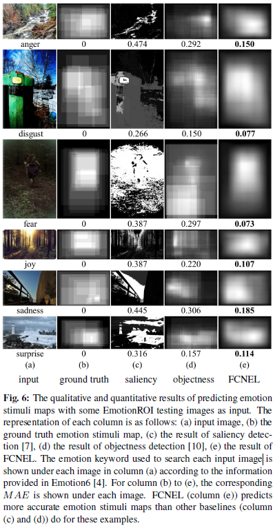
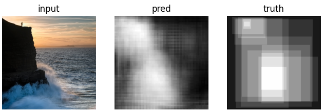
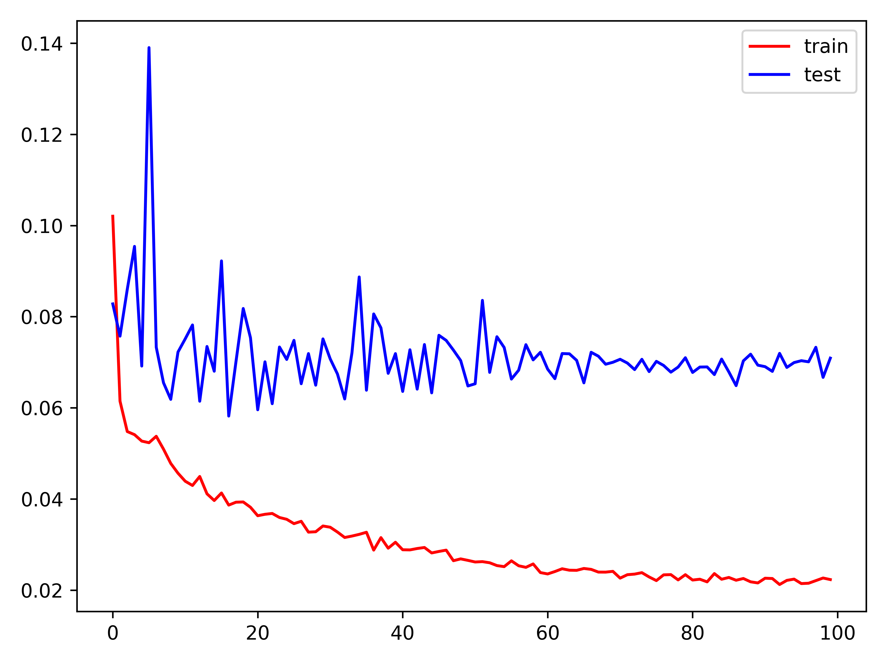
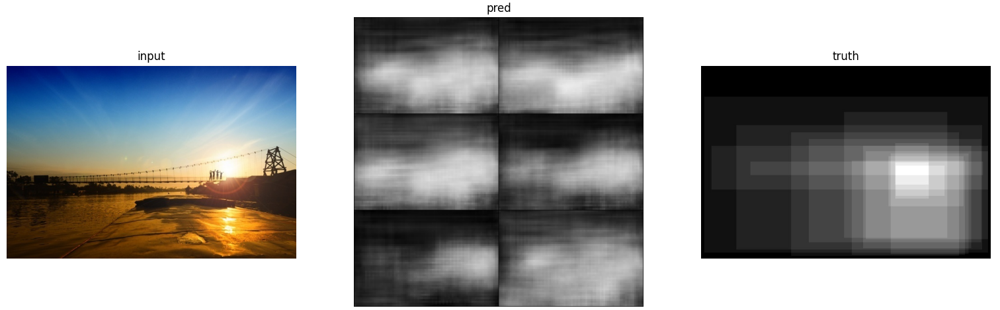
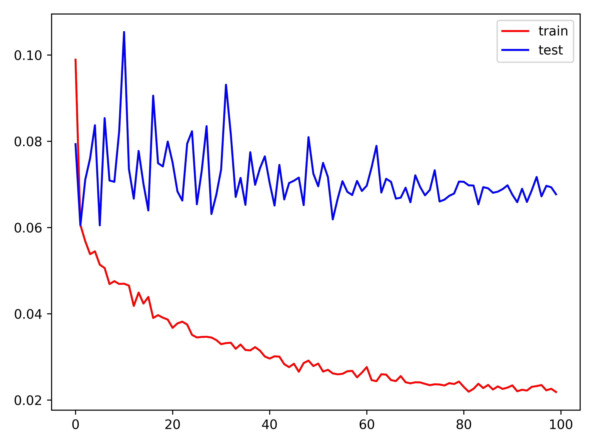
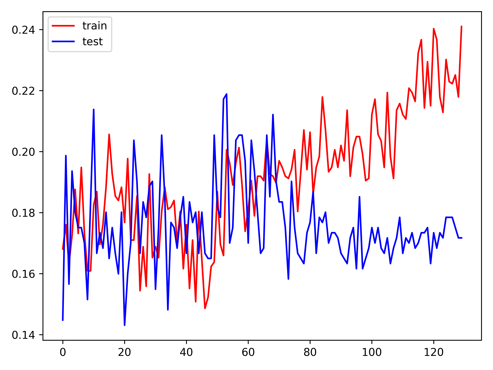

# EmotionROI-ex

    Unofficial implementation of the EmotionROI essay and extended applications

----

Reproduction the **FCNEL** model in essay [WHERE DO EMOTIONS COME FROM? PREDICTING THE EMOTION STIMULI MAP](http://chenlab.ece.cornell.edu/Publication/Kuan-Chuan/ICIP16_EmotionROI.pdf), and extended applications.

The results reported in the EmotionROI/FCNEL essay:

### Reproduce FCNEL for ROI prediction

⚠ Can NOT reproduce essay results exactly, here're the implementation differences:

- The essay uses `FCN-32s + AlexNet`, we use `FCN-8s + ResNet50`
- The essay uses `lr=1e-8` to refine `20` epochs, which is two small and doesn't have any effect in our setting, we instead use `lr=1e-2` to train `100` epochs with `CosineAnnealingLR`
- The essay might use the default `Bilinear` for output upsacling, we instead use `Nearest-Exact` to simulate `FCN-32s` resolution

  

### Modifyied EmoFCNEL for ROI prediction with emotion condition

ℹ Predict ROI with any emotion label (except for `sadness`) results into nearly the same output...  
ℹ The ROI annotations are probably NOT related to certain emotion, but only indicates **human attention focus**  

### Predict emotion directly from ROI annotation

⚠ Mission impossible :(

| Model | Train acc. | Test acc. |
| :-: | :-: | :-: |
| Resnet50 | 24.098% | 17.172% |

### references

- essay
  - info page: [http://chenlab.ece.cornell.edu/publications.html](http://chenlab.ece.cornell.edu/publications.html)
  - download link: [http://chenlab.ece.cornell.edu/Publication/Kuan-Chuan/ICIP16_EmotionROI.pdf](http://chenlab.ece.cornell.edu/Publication/Kuan-Chuan/ICIP16_EmotionROI.pdf)
- EmotionROI dataset
  - info page: [http://chenlab.ece.cornell.edu/downloads.html](http://chenlab.ece.cornell.edu/downloads.html)
  - download link: [http://chenlab.ece.cornell.edu/people/kuanchuan/publications/EmotionROI.zip](http://chenlab.ece.cornell.edu/people/kuanchuan/publications/EmotionROI.zip)

----
by Armit
2023/12/27 
